# PHYSICS-AI: Thermodynamically Consistent Deep Learning for Materials

[](https://opensource.org/licenses/MIT)
[](https://www.python.org/downloads/)
[](https://tensorflow.org/)

A **Physics-Informed Deep Learning (PIDL)** framework for modeling complex material behavior while enforcing thermodynamic consistency. This repository implements a novel approach that combines Long Short-Term Memory (LSTM) networks with Feed-Forward Neural Networks (FFNNs) to predict the mechanical response of nanoparticle-filled epoxy composites under varying ambient conditions.


## 🎯 Overview

This framework addresses the challenge of modeling complex material behavior by:

- **Enforcing Physics**: Incorporating thermodynamic principles directly into the neural network architecture
- **Capturing History**: Using LSTMs to model history-dependent material behavior through internal state variables
- **Ensuring Consistency**: Guaranteeing thermodynamic consistency through physics-based loss terms
- **Handling Complexity**: Managing multi-scale effects from temperature, moisture, and nanoparticle content variations

### Key Innovation

The model uniquely combines:
1. **LSTM Networks** → Predict evolution of internal state variables
2. **FFNN for Free Energy** → Approximate the material's thermodynamic state
3. **Automatic Differentiation** → Derive stress from free energy (∂Ψ/∂C)
4. **Physics Constraints** → Enforce non-negative dissipation and thermodynamic laws

## 🚀 Features

### ✨ Core Capabilities
- **Thermodynamic Consistency**: Automatic enforcement of physical laws through custom loss functions
- **Multi-Scale Modeling**: Handles effects from molecular (moisture) to macro (fiber orientation) scales
- **Environmental Sensitivity**: Accounts for temperature, moisture content, and nanoparticle volume fraction
- **History Dependence**: Captures path-dependent material behavior through internal variables
- **Experimental Data Driven**: Trained directly on experimental stress-strain data

### 🔬 Scientific Features
- **Physics-Informed Architecture**: Custom neural network layers that respect continuum mechanics
- **Automatic Stress Derivation**: Stress computed as σ = 2∂Ψ/∂C using TensorFlow's automatic differentiation
- **Dissipation Monitoring**: Real-time calculation and enforcement of non-negative energy dissipation
- **Free Energy Learning**: Neural network approximation of Helmholtz free energy function

### 🛠️ Technical Features
- **Modular Design**: Easily adaptable to different material systems
- **Comprehensive Logging**: Detailed training metrics and physics constraint monitoring
- **Flexible Data Pipeline**: Support for various experimental data formats
- **GPU Acceleration**: Optimized for high-performance computing environments

## 📋 Requirements

### System Requirements
- **Python**: 3.8 or higher
- **GPU**: NVIDIA GPU with CUDA support (recommended)
- **Memory**: Minimum 8GB RAM, 16GB+ recommended for large datasets

### Dependencies
```bash
# Core dependencies
tensorflow >= 2.8.0
numpy >= 1.21.0
scipy >= 1.7.0
matplotlib >= 3.5.0

# Optional but recommended
nvidia-cudnn-cu11  # For GPU acceleration
```

## 🔧 Installation

### Option 1: Clone and Install
```bash
# Clone the repository
git clone https://github.com/BBahtiri/Deep-Learning-Constitutive-Model.git
cd Deep-Learning-Constitutive-Model

# Create virtual environment (recommended)
python -m venv physics_ai_env
source physics_ai_env/bin/activate  # On Windows: physics_ai_env\Scripts\activate

# Install dependencies
pip install -r requirements.txt
```

### Option 2: Direct Installation
```bash
pip install tensorflow numpy scipy matplotlib
# Add nvidia-cudnn-cu11 for GPU support
```

### GPU Setup (Optional but Recommended)
```bash
# For NVIDIA GPU support
pip install nvidia-cudnn-cu11
```

## 📁 Project Structure

```
PHYSICS-AI/
├── 📄 Main_ML.py              # Main training and evaluation script
├── 🧠 DL_model.py             # Core neural network architecture
├── 🔧 misc.py                 # Data loading and preprocessing utilities
├── 📊 data_experiments_train/ # Training experimental data (.mat files)
├── 📊 data_experiments_validation/ # Validation experimental data
├── 📁 experiment_outputs_pinn/ # Generated results and outputs
├── 📁 checkpoints/            # Model checkpoints during training
├── 📄 requirements.txt        # Python dependencies
├── 📄 README.md              # This file
└── 🖼️ pinn.PNG               # Architecture diagram
```

## 🏃‍♂️ Quick Start

### 1. Prepare Your Data
Organize your experimental data in the following structure:
```
data_experiments_train/
├── epoxy_1_1_1_001.mat
├── epoxy_1_1_2_001.mat
└── ... (more .mat files)

data_experiments_validation/
├── epoxy_2_1_1_001.mat
└── ... (validation .mat files)
```

**Expected .mat file contents:**
- `expStress`: Experimental stress data
- `trueStrain`: True strain measurements  
- `timeVec`: Time vector for the experiment

### 2. Configure Hyperparameters
Edit the hyperparameters in `Main_ML.py`:

```python
# Network Architecture
layer_size = 30              # LSTM and Dense layer units
layer_size_fenergy = 30      # Free energy network units
internal_variables = 8       # Number of internal state variables

# Training Parameters
learning_rate = 0.0001       # Initial learning rate
num_epochs = 5000           # Maximum training epochs
batch_size = 16             # Training batch size
timesteps = 1000            # Sequence length for LSTM
```

### 3. Run Training
```bash
python Main_ML.py
```

### 4. Monitor Results
Training outputs are saved to structured directories:
- `./final_predictions/` - Model predictions and internal states
- `./stress_exact/` - Ground truth stress data
- `./weights/` - Final trained model weights
- `./checkpoints/` - Training checkpoints

## 📊 Data Format

### Input Data Requirements
Your `.mat` files should contain:

| Variable | Description | Shape | Units |
|----------|-------------|-------|-------|
| `expStress` | Experimental stress | [n_timesteps, 1] | MPa |
| `trueStrain` | True strain | [n_timesteps, 1] | dimensionless |
| `timeVec` | Time vector | [n_timesteps, 1] | seconds |

### Filename Convention
The code expects filenames in the format: `epoxy_X_Y_Z_*.mat`
- **X**: Nanoparticle content indicator (1=0%, 2=5%, 3=10%)
- **Y**: Moisture condition (1=dry, 2=saturated)  
- **Z**: Temperature condition (1=-20°C, 2=23°C, 3=50°C, 4=60°C)

## 🧠 Model Architecture

### Overall Framework

```mermaid
graph TD
    A[Input Sequence] --> B[LSTM Layer 1]
    B --> C[LSTM Layer 2]
    C --> D[Dense Layers]
    D --> E[Internal Variables]
    E --> F[Free Energy Network]
    A --> F
    F --> G[Free Energy Ψ]
    G --> H[Automatic Differentiation]
    H --> I[Stress σ = 2∂Ψ/∂C]
    E --> J[Dissipation Calculation]
    I --> K[Physics-Informed Loss]
    J --> K
```


### Key Components

#### 1. LSTM Networks
- **Purpose**: Capture history-dependent behavior
- **Architecture**: Two stacked LSTM layers
- **Output**: Hidden states representing material memory

#### 2. Internal Variable Prediction
- **Input**: LSTM hidden states
- **Architecture**: Time-distributed dense layers
- **Output**: Evolution of internal state variables (z_i)

#### 3. Free Energy Network
- **Input**: Internal variables + strain measure
- **Architecture**: Dense layers with physics constraints
- **Constraints**: Non-negative weights, softplus activation
- **Output**: Helmholtz free energy (Ψ)

#### 4. Physics Enforcement
- **Stress Derivation**: σ = 2∂Ψ/∂C via automatic differentiation
- **Dissipation**: D = -∑(τ_i · ż_i) where τ_i = -∂Ψ/∂z_i
- **Constraints**: D ≥ 0 (thermodynamic consistency)

## ⚙️ Advanced Usage

### Custom Material Systems

To adapt for different materials:

1. **Modify data loading** in `misc.py`:
```python
def getData_exp(input_mat_file_path, target_sequence_length=1000):
    # Adapt for your data format
    mat_contents = scipy.io.loadmat(input_mat_file_path)
    # Modify key names as needed
    stress_raw = mat_contents['your_stress_key']
    # ... rest of implementation
```

2. **Adjust feature extraction** in `read_dictionaries_exp()`:
```python
# Modify filename parsing for your naming convention
# Original: extracts nv, zita, temp from positions 6, 8, 10
nv = parse_your_parameter(filename)
zita = parse_another_parameter(filename)
```

3. **Update network architecture** in `DL_model.py`:
```python
# Adjust number of internal variables for your physics
internal_variables = 12  # Example: more complex material

# Modify free energy inputs if needed
# Current: [internal_variables, strain_measure]
```

### Custom Physics Constraints

Add domain-specific physics in `DL_model.py`:

```python
def call(self, normalized_inputs_seq):
    # ... existing code ...
    
    # Add your custom physics constraint
    custom_physics_penalty = your_physics_function(psi_final_full_sequence)
    self.add_loss(custom_physics_penalty * weight_factor)
    
    return norm_pred_stress_for_loss
```

### Hyperparameter Tuning

Key hyperparameters to optimize:

```python
# Architecture
layer_size = [20, 30, 50]           # Network capacity
internal_variables = [6, 8, 12]     # Complexity of internal state
layer_size_fenergy = [20, 30, 50]   # Free energy network size

# Training
learning_rate = [1e-5, 1e-4, 1e-3]  # Learning rate schedule
batch_size = [8, 16, 32]            # Memory vs. gradient quality
timesteps = [500, 1000, 2000]       # Sequence length vs. memory
```

## 📈 Evaluation and Visualization

### Training Metrics
The framework automatically tracks:
- **Primary Loss**: Mean Absolute Error on stress prediction
- **Physics Penalties**: Dissipation and free energy constraints
- **Validation Performance**: Generalization metrics

### Output Analysis
Post-training analysis includes:
- **Stress-Strain Curves**: Compare predictions vs. experiments
- **Internal Variable Evolution**: Track material state changes
- **Free Energy Landscapes**: Visualize thermodynamic surfaces
- **Dissipation Monitoring**: Verify physics compliance

### Visualization Example
```python
import matplotlib.pyplot as plt
import numpy as np

# Load results
stress_pred = np.loadtxt('./final_predictions/stress_pred_unnorm_0.txt')
stress_true = np.loadtxt('./stress_exact/stress_unnorm_0.txt')
strain = np.loadtxt('./strain/strain_unnorm_0.txt')

# Plot stress-strain comparison
plt.figure(figsize=(10, 6))
plt.plot(strain[1:], stress_true, 'b-', label='Experimental', linewidth=2)
plt.plot(strain[1:], stress_pred, 'r--', label='PIDL Prediction', linewidth=2)
plt.xlabel('Strain')
plt.ylabel('Stress (MPa)')
plt.legend()
plt.grid(True)
plt.title('PIDL Model Performance')
plt.show()
```

## 🔬 Scientific Background

### Theoretical Foundation

This implementation is based on the thermodynamically consistent framework for materials modeling:

1. **Helmholtz Free Energy**: Ψ(C, z_i, θ) defines the material's thermodynamic state
2. **Stress Derivation**: σ = 2∂Ψ/∂C (from continuum mechanics)
3. **Evolution Laws**: ż_i governed by thermodynamic forces τ_i = -∂Ψ/∂z_i
4. **Dissipation**: D = -∑τ_i·ż_i ≥ 0 (second law of thermodynamics)

### Key Advantages

- **Physics Consistency**: Guaranteed satisfaction of thermodynamic laws
- **Interpretability**: Internal variables have physical meaning
- **Generalization**: Physics constraints improve extrapolation
- **Data Efficiency**: Physics guidance reduces data requirements

## 📚 Citation

If you use this code in your research, please cite:

```bibtex
@article{bahtiri2024thermodynamically,
  title={A thermodynamically consistent physics-informed deep learning material model for short fiber/polymer nanocomposites},
  author={Bahtiri, Betim and Arash, Behrouz and Scheffler, Sven and Jux, Maximilian and Rolfes, Raimund},
  journal={Computer Methods in Applied Mechanics and Engineering},
  volume={427},
  pages={117038},
  year={2024},
  publisher={Elsevier},
  doi={https://doi.org/10.1016/j.cma.2024.117038}
}
```


### Areas for Contribution
- **New Material Systems**: Adapt framework for metals, ceramics, biologics
- **Enhanced Physics**: Add new thermodynamic constraints
- **Optimization**: Improve computational efficiency
- **Visualization**: Enhanced plotting and analysis tools
- **Documentation**: Tutorials and examples

### Development Setup
```bash
# Fork and clone your fork
git clone https://github.com/BBahtiri/Deep-Learning-Constitutive-Model.git
cd Deep-Learning-Constitutive-Model

# Create development environment
python -m venv dev_env
source dev_env/bin/activate

# Install in development mode
pip install -e .
pip install -r requirements-dev.txt  # Include testing dependencies

# Run tests
python -m pytest tests/
```

## 🐛 Troubleshooting

### Common Issues

**GPU Memory Errors**
```python
# In Main_ML.py, reduce batch size or sequence length
batch_size = 8  # Reduce from 16
timesteps = 500  # Reduce from 1000
```

**Convergence Issues**
```python
# Try different learning rates or architectures
learning_rate = 1e-5  # Reduce learning rate
layer_size = 20       # Simplify architecture
```

**Data Loading Errors**
- Verify `.mat` file structure matches expected format
- Check filename conventions match parsing logic
- Ensure sufficient data files in train/validation directories

### Getting Help
- 📧 **Email**: [betimbahtiri@outlook.de]
- 🐛 **Issues**: [GitHub Issues](https://github.com/BBahtiri/Deep-Learning-Constitutive-Model/issues)
- 💬 **Discussions**: [GitHub Discussions](https://github.com/BBahtiri/Deep-Learning-Constitutive-Model/discussions)


---

**⭐ Star this repository if you find it useful!**
